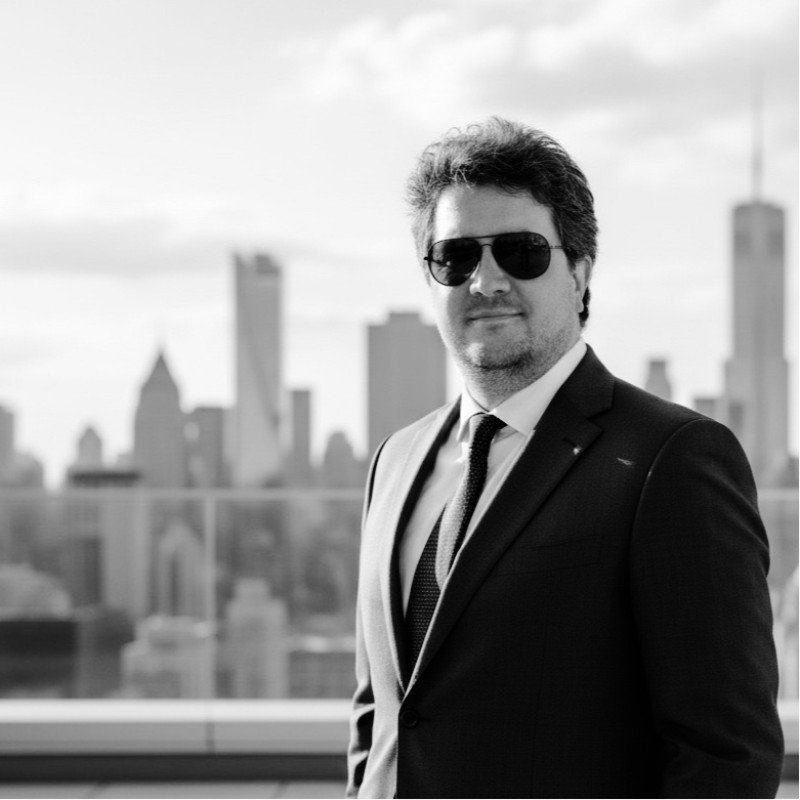

# 🌐 helloworld.com.ar | Armando Andrés Meabe

<h1>
  <i>
Todo sistema tiende a la entropía; documentar es nuestra forma de rebeldía frente al olvido.
</i>
</h1>

  

Este es el repositorio central de mi blog personal. Un espacio para documentar mi camino, compartir experimentos de ingeniería y reflexionar sobre la intersección entre el software y la inteligencia artificial.

---

### 👨‍💻 Perfil Profesional
**AI Architect & Tech Leader**
> *LLMs & Agentic Workflows • Expert in C++ & .NET • 18+ years in Microsoft Ecosystem • Former Microsoft Academic R&D • Researcher & Speaker*

### 📝 ¿Qué vas a encontrar acá?
Escribo sobre lo que me mantiene despierto (o me ayuda a dormir):
*   **🤖 Inteligencia Artificial:** De la teoría a la práctica. Agentic workflows, modelos locales y el futuro del desarrollo asistido.
*   **🏗️ Arquitectura & Cloud:** Construyendo sistemas resilientes en Azure y .NET que no se rompan a las 3 AM.
*   **🔥 Hardware & Performance:** Crónicas sobre cómo domar procesadores i9, optimizar hardware de Apple y la eterna búsqueda de la refrigeración perfecta.
*   **📸 Realidad Documental:** Fotografía de calle y documental; capturando fragmentos de la realidad social con equipos discretos.
*   **⏳ Horología:** La ingeniería del tiempo. Coleccionismo y modificación de relojes mecánicos.

---

### 📬 Conectemos
¿Interesado en IA, arquitectura de software o por qué un reloj Victorinox automático es una obra de arte?
*   **Web:** [helloworld.com.ar](https://helloworld.com.ar)
*   **LinkedIn:** [in/armandomeabe](https://www.linkedin.com/in/armandomeabe/)
*   **Gravatar:** [armandomeabe](https://gravatar.com/armandomeabe)
